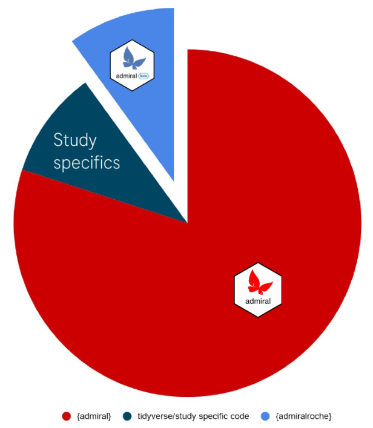
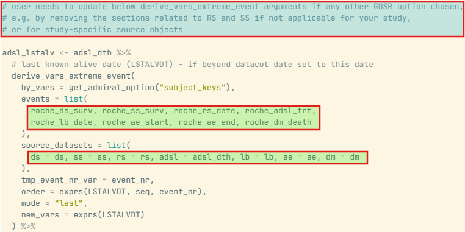
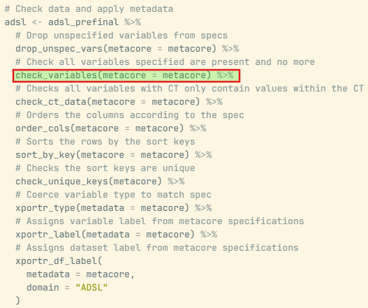

```{r setup, include=FALSE}
knitr::opts_chunk$set(echo = FALSE, warning = FALSE, message = FALSE)
```

# Abstract

Writing template code is just as much an art as it is a skill, requiring balancing solid starting points with flexibility for custom adaptations. For developers, maintaining templates while ensuring consistency and eliminating repetitive tasks is a constant struggle. 

Over the past years, Roche's fast transition to R for ADaM programming challenged the `{admiralroche}` team to rethink our process, requiring constant evolution to provide fit for purpose templates. In this paper, we walk readers through our journey of levelling up our templates, starting by exploring how and why we initially set up the `{admiralroche}` package extension and why we then centralised template maintenance by deconstructing templates into modular blocks (code that writes code). Finally, we unveil our latest frontier: dynamic ADaM template generation. By passing ADaM specifications to our package, we automatically create and assemble the right blocks into a customized template script (code that writes code that writes code!).
We will discuss our challenges and learnings, sharing experiences on reduced maintenance and time saved. Join us to see why, in the quest for the ultimate ADaM template, deterministic automation trumps probabilistic AI.


# Introduction

The `{admiral}` package and its wider "pharmaverse" ecosystem [pharmaverse.org] are the **de facto** standard tools to create Analysis Data Model (ADaM) datasets in R. `{admiral}` deliberately does not attempt to be a complete, drop-in solution; rather, it provides composable, reusable derivation functions and leaves the programmer to decide *which* functions to use, *how* to use them, *in what order* to do so, and most importantly, *where* to intersperse sponsor/study-specific code. This is by design, since the fine details of how any given company or study implements the ADaM standards inevitably vary.

This paradigm has led some sponsors to build company-specific extensions on top of `{admiral}`, which can both:

- Provide custom functions to implement company-specific derivation choices;
- Make available a library of ADaM template scripts that implement those choices in a consistent, repeatable way.

For a presentation and paper discussing Roche's own journey setting up `{admiralroche}`, the interested reader can consult Ross Farrugia's **"OS05: {admiral} – From Open Source Through to Company Implementation"** [presentation](https://phuse.s3.eu-central-1.amazonaws.com/Archive/2024/Connect/US/Bethesda/PRE_OS05.pdf) and [paper](https://phuse.s3.eu-central-1.amazonaws.com/Archive/2024/Connect/US/Bethesda/PAP_OS05.pdf) from the PHUSE US Connect 2024 conference. Building on this material, this paper and the talk it accompanies tell the story of how the way we provide ADaM template scripts through `{admiralroche}` has evolved over time, moving through three distinct stages that give the talk its title:

1. **Code.** A library of static, human-written ADaM template scripts, one per domain, distributed inside `{admiralroche}` itself.
2. **Code that writes code.** An internal R package, `{scriptr}`, that abstracts the common building blocks shared across those templates into reusable, parameterised "chunks" which are then assembled programmatically rather than copy-pasted.
3. **Code that writes code that writes code.** A companion package, `{admiralrochetools}`, that combines `{scriptr}`'s assembly engine with a short interactive questionnaire and a study's own specification, so that running a single function produces a template already tailored to that study's derivation choices, with no manual search-and-replace required.

# Background: Why {admiralroche} and ADaM templates?

## {admiralroche} covers the ~10% of Roche's ADaM standards that {admiral} does not

```{r fig1, echo=FALSE, results="asis", fig.cap="Code split across ADaM programs at Roche"}
if (knitr::is_latex_output()) {
  cat(
    "\\begin{wrapfigure}{r}{0.36\\textwidth}\n",
    "\\centering\n",
    "\\includegraphics[width=0.34\\textwidth]{figures/pie_chart.png}\n",
    "\\caption{Code split across ADaM programs at Roche}\n",
    "\\end{wrapfigure}\n"
  )
} else {
  
}
```

Heuristically, it has been observed that for most given ADaM datasets at Roche (and most likely for other sponsors too), around 80% of the variable and parameter derivations are covered by functions from the `{admiral}` package, such as `derive_vars_dt()`, `derive_vars_merged()`, `derive_param_exist_flag()`. A further ~10% is manually programmed code that is genuinely specific to an individual study, and has no business being standardised into any shared package. The remaining ~10% is where `{admiralroche}` comes in: it reflects Roche's own interpretation of the ADaM standards, for example, which imputation techniques to apply, sponsor-specific variables and parameters, helper code to interact with Roche's chosen statistical computing environment (SCE), and glue code for other pharmaverse packages such as `{metatools}`, `{metacore}` and `{xportr}` which Roche has chosen to use as part of its ADaM pipeline.

## Accessing ADaM templates

Even before any sponsor extension enters the picture, `{admiral}` already makes starting a new ADaM program straightforward, via `use_ad_template()`. Calling it with a domain name and `package = "admiral"` generates a ready-made, generic template script for that domain directly into the user's project:

```r
library(admiral)

admiral::use_ad_template(
  "adsl",
  package = "admiral"
)
```

However, these templates are simply generic starting points. As mentioned in the previous section, most sponsors will likely wish to provide more customised templates which are closer to their implementation of ADaM standards, work better within their SCE, etc. If a sponsor has created a sponsor-specific extension package like `{admiralroche}`, they can distribute their own versions of ADaM templates by leveraging the same `use_ad_template()` function and updating the `package` argument.

```r
library(admiral)
library(admiralroche)

admiral::use_ad_template(
  "adsl",
  package = "admiralroche"
)
```

## Features of sponsor ADaM templates

As expected, `{admiralroche}`'s ADaM templates showcase a healthy mix of standard `{admiral}` code customised to fit Roche's requirements, calls to `{admiralroche}` functions, and placeholders for study-specific code. Below are examples of each from the `ADSL` template.

Helper code to read in data cut date:
```r
## Datacut date ----
# Get cut-off date from ATLAS activity.json meta file
activity_json <- read_json("metadatain/atlas/activity.json")
cut_date <- activity_json$activity_ccod
# pass in datacut date (in form as.Date("2020-12-31") for example)
adsl_dcut <- dm %>%
  # datacut date (DCUTDT)
  mutate(DCUTDT = as.Date(cut_date))
```

Leveraging an `{admiral}` function but using Roche-specific arguments to derive treatment start date:
```r
  # treatment start date (TRTSDTM)
  derive_vars_merged(
    dataset_add = ex_ext,
    filter_add = (EXDOSE > 0 | (EXDOSE == 0 & str_detect(EXTRT, "PLACEBO"))) &
      !is.na(EXSTDTM),
    new_vars = exprs(TRTSDTM = EXSTDTM),
    order = exprs(EXSTDTM, EXSEQ),
    mode = "first",
    by_vars = get_admiral_option("subject_keys")
  ) %>%
```

Using `{admiralroche}`-specific functions to derive Roche ADaM variables:
```r
  # age group 1 (AGEGR1)
  admiralroche::derive_var_agegr1() %>%
  # age group 2 (AGEGR2)
  admiralroche::derive_var_agegr2() %>%
```

Study-specific treatment arm derivation placeholders:
```r
  # treatment variables (TRT01P/TRT01A)
  mutate(TRT01P = ARM, TRT01A = ACTARM) %>%
```

# Stage 1: *Code* - static ADaM templates

Throughout its first releases, `{admiralroche}` put the `use_ad_template()` mechanism introduced in Section 3 to direct use: it shipped a static, human-written ADaM template script for every domain covered by Roche's global standards - `ADSL`, `ADAE`, `ADVS`, `ADLB`, and so on — each one hard-coding Roche's standard interpretation of that domain's derivations and mixing together the `{admiral}` calls, `{admiralroche}` helper functions, and study-specific placeholders illustrated in Section 3.3. A programmer starting a new study would call `use_ad_template()` function (with the appropriate arguments), receive a copy of the relevant script in their project, and edit it by hand to fit the study at hand.

## Pros and cons of the static template approach

This approach was the simplest possible way to package company-specific ADaM logic, and its strengths followed directly from that simplicity:

- **Simple to maintain for developers.** A template was just a plain R script; adding or updating one required no tooling beyond an editor and `{admiralroche}`'s usual code review process.

- **Simple for users to access and use.** A single call to `use_ad_template("<adam_name>", package = "admiralroche")` was all a programmer ever needed to retrieve a Roche-specific starting point.

- **The easiest way to initially set up {admiralroche}.** Static templates let the package reach its first users quickly, without first having to design any abstraction layer.

The cost of that simplicity, however, grew with the size of the template library:

- **Difficult to cater for many different options, especially if complex.** Each template hard-coded one interpretation of a derivation - usually the most popular one from Roche's global standards. User who needed a different option had to find and edit the relevant lines by hand, with limited guidance in the form of a comment to help guide the way.

- **Duplication of code for sections common to all templates.** By the time `{admiralroche}` had accumulated more than twenty ADaM templates, several recurring patterns, for example, the logic for deriving `AENDTM`/`AENDT` consistently across the ADCM and ADMH templates, or standard subject-level flag derivations repeated across nearly every template, existed as near-identical, hand-copied blocks of code in many files at once.

```{r fig2, fig.cap="A portion of the ADSL template, showing a comment (in blue) warning users that if they need to update the LSTALVDT derivation, they will need to update the function call themselves (by editing the code in green).", out.width="90%", fig.align="center"}

```

```{r fig3, fig.cap="All \\{admiralroche\\} ADaM templates have the following block at the end to run checks, assign labels and order columns. An update to any one of these functions (e.g. check\\_variables()) would require updating every template.", out.width="70%", fig.align="center"}

```

This second point turned out to be the more serious limitation in practice. Any refactor, bug fix, or change in a Roche standard had to be propagated by hand into every template that contained the affected block, and so there was always a risk that a fix may land in some templates but be missed in others. 

# Stage 2: *Code that writes code* - Abstracting away the ADaM templates

## The problem: duplication without a shared abstraction

As hinted, the static-template approach was a good starting point, but had no mechanism for saying "this block of code is used, with minor variations, in these six templates - treat it as one thing." Every template was an independent, flat R script, so the *only* way to reuse logic across templates was to copy it. To circumvent this issue, the `{admiralroche}` team developed an internal helper package, `{scriptr}`. This package introduced a proper abstraction layer between "a reusable unit of ADaM logic" and "a finished script" so that changes to the underlying logic only ever needed to be made in one place.

## `{scriptr}`'s core data model: "chunks" and "calls"

`{scriptr}` organises code around two first-class objects, referred to internally as **chunks** and **calls**. A chunk is a general-purpose, reusable block of R code (i.e. anything from a single derivation call to a short multi-line sequence) registered once via `add_chunk()`. A call is the more specialised case of a chunk that wraps exactly one function invocation (typically an `{admiral}` derivation function), registered via `add_call()`. Calls are intended to be inserted into pipes and therefore their definition doesn't include the input and output objects.

```r
library(scriptr)
library(admiral)

add_chunk(
  id = "load_ae",
  description = "Read the AE SDTM domain",
  {
    ae <- read_parquet("data/sdtm/ae.parquet")
  }
)

add_call(
  id = "derive_aendt",
  description = "Derive the AE end date (AENDT) for a single template",
  derive_vars_dt(
    new_vars_prefix = "AEN",
    dtc = AEENDTC,
    highest_imputation = "M",
    date_imputation = "first"
  )
)
```

As written, `derive_aendt` is only useful for the one template that happens to need `AENDT` derived with "first"-day imputation - exactly the kind of near-identical, hand-copied block described in Section 5.1. The templating syntax introduced below is what turns a call like this into something reusable across every template that needs the same derivation, with only the details that genuinely differ left open as placeholders.

## `{scriptr}`'s templating syntax

The templating mechanism is deliberately built on vocabulary borrowed from `{rlang}`'s quasiquotation, since many R developers already have some intuition for it. A chunk or call template can mark a placeholder for single-value substitution with a `++` sigil (mirroring `!!`), and a placeholder for multi-value, "splice in a list" substitution with `+++` (mirroring `!!!`). When a template is instantiated, values are supplied for these placeholders.

Two helper functions cover the common cases of building up dynamic text inside a template: `glue_sym()` constructs a syntactically valid R symbol from string fragments (for example, gluing a variable stem and a suffix into a single identifier), while `glue_char()` builds a dynamic character string, and can lean on `{cli}`'s pluralisation helpers so that, for example, a comment can correctly say "the following variable" versus "the following variables" depending on how many were substituted. 

Returning to the `AENDT` example, `derive_aendt` can be rewritten as a call template with two placeholders: `++prefix`, the variable stem shared by the `*ENDTC` source and the derived `*ENDT` variable, and `++imputation`, the one detail that genuinely differs between the `ADCM` and `ADMH` templates. `glue_sym()` builds the `dtc` argument's symbol from `++prefix` at instantiation time, and `defaults` supplies the value used whenever a caller does not override it:

```r
add_call_template(
  "derive_end_dt",
  description = "Derive an end date from a *ENDTC variable",
  comment = glue_char("Derive end date from {prefix}ENDTC variable"),
  derive_vars_dt(
    new_vars_prefix = "AEN",
    dtc = glue_sym("{prefix}ENDTC"),
    highest_imputation = "M",
    date_imputation = ++imputation
  ),
  defaults = list(imputation = "first")
)
```

A single template definition now serves both templates. `ADCM` uses the default "first"-day imputation and need not mention it at all, while `ADMH` overrides it to "last":

```r
insert_calls(
  input = adcm,
  ids = exprs(derive_end_dt(prefix = "CM")),
  output = adcm
)

insert_calls(
  input = admh,
  ids = exprs(derive_end_dt(prefix = "MH", imputation = "last")),
  output = admh
)
```

A change to how `AENDT` should be derived - a new imputation rule, an extra argument, a bug fix - now only ever needs to be made once, in the `derive_end_dt` template, rather than hunted down across every template file that copied it by hand.

## Assembly: from chunks to a finished script

Registering chunks and calls is only half of `{scriptr}`; the other half is turning a selection of them into an actual, well-formatted R script. `insert_chunks()` takes a list of chunk identifiers (conventionally captured as unevaluated expressions via `exprs()`, so that argument names can double as chunk identifiers) and inlines them, in the order given, into the developing script. `insert_calls()` does the equivalent job for calls, and additionally understands the notion of an "input" and an "output" - letting a developer specify, for instance, that a chain of calls should thread the same dataset through each derivation step in turn, producing a pipe-style sequence rather than a flat list of independent statements. 

The top-level entry point that ties this together is `execute()`, which takes an accumulated set of chunk/call insertions (as well as any arbitrary code that doesn't fit in a chunk/call) together with a target filename and produces a finished `.R` file. Before writing that file, `{scriptr}` passes the assembled code through `{styler}`'s `style_code()`, using a house style configuration, so that the generated script is indistinguishable in formatting from one a Roche programmer would have written by hand — consistent indentation, consistent pipe placement, and no tell-tale artefacts of programmatic generation.

Putting the `load_ae` chunk and the `derive_end_dt` call template from the previous two sections together, generating the relevant section of the `ADCM` template is a single `execute()` call:

```r
execute(
  {
    insert_chunks(ids = exprs(load_cm))

    adcm <- cm
    insert_calls(
      input = adcm,
      ids = exprs(derive_end_dt(prefix = "AEN")),
      output = adcm
    )
  },
  filename = "programs/adam/ad_adcm.R"
)
```

which writes the following, already-formatted script to `ad_adcm.R`, ready for a programmer to open and continue building on:

```r
ae <- read_parquet("data/sdtm/ae.parquet")

adcm <- cm
adcm <- adcm %>%
  derive_vars_dt(
    new_vars_prefix = "AEN",
    dtc = AEENDTC,
    highest_imputation = "M",
    date_imputation = "first"
  )
```

The equivalent call for `ADMH` differs only in the arguments passed to `derive_end_dt()`, yet both scripts are generated from the same underlying chunk and call template — precisely the "write it once, generate it everywhere" property that static templates could not offer.

## Accessing and browsing existing chunks and calls

Registered chunks and calls live in an in-memory store attached to the current R session, and `{scriptr}` provides `get_reactable()` to browse the full contents of that store interactively (rendered as a searchable table), which is invaluable when a developer is trying to find out whether a chunk implementing a given piece of logic already exists before writing a new one. Because different packages may want to maintain their own independent chunk libraries, `{scriptr}` supports a **federated store** pattern: `set_scriptr_sources()` lets a downstream package (such as `{admiralrochetools}`, discussed in Section 6) register its own chunk source alongside or instead of the default one, and `get_source_env()` resolves which environment a given lookup should use. The excerpt below, taken from `{admiralrochetools}`'s own template-generation code, shows this in practice: it points `{scriptr}` at its own package namespace *and* at a private, internal environment holding Roche's confidential chunk and call library, so that the two can be searched together as if they were a single store:

```r
set_scriptr_sources(list("admiralrochetools", admiralroche_scriptr_private))
```

# Creating a new `{admiralrochetools}` package to the store template machinery

Once the `{scriptr}` machinery was in place to help abstract and generalise the `{admiralroche}` ADaM templates, a decision was made to split `{admiralroche}` into two:

- `{admiralroche}` would retain the Roche-specific derivation functions and their documentation
- A new `{admiralrochetools}` package was created to house all the machinery for the ADaM templates.

The main reason behind this split was of a regulatory nature. Any Roche regulatory submission of R code requires the `{admiralroche}` package to be submitted too, in order for the ADaM programs to be readable. However, there is no need to submit the ADaM templates, nor the machinery used to create them, since once the code has been generated, the templates are no longer used in the ADaM derivation process. Moving the machinery to `{admiralrochetools}` meant future submissions would not need to include this package, reducing the size of the submission and the number of packages that need to be documented.

From a user perspective, the only difference was that the `package` argument to `use_ad_template()` needed to be updated to point at `{admiralrochetools}` instead of `{admiralroche}`:

```r
library(admiral)
library(admiralrochetools)

admiral::use_ad_template(
  "adsl",
  package = "admiralrochetools"
)
```

# Stage 3 - *Code that writes code that writes code* - Dynamic template generation

## From "assemble what a developer selects" to "ask the programmer exactly what they need"!

`{scriptr}` chunk-based abstract templates improved the maintenance of Roche ADaM templates from a developer perspective. From a user standpoint though, nothing had changed, since the end result of calling `use_ad_template("adxx", package = "admiralrochetools")` was still always the same static ADaM template, which would still need editing in cases where the user chose less popular options for any derivations. In other words, for any given ADaM dataset, there was still no real way to offer *options*.

However, there was scope to go further: the library of chunks in `{admiralrochetools}` already existed, so all that was required was a way for the user to feed instructions to `{admiralrochetools}` about which options they have selected - something like: "I want to build "ADSL" for a randomised study, so I need to use the randomisation date variable `RANDDT`  and I would like the last alive date variable `LSTALVDT` to use any lab, adverse events or disposition records..." - and then `{admiralrochetools}` would cleverly select the right chunks for the specific use-case and provide a *dynamically customised ADaM template* that is as close as possible to the user's needs.

The following section details how we set up dynamic template-creating functions `use_adxx_template()` in `{admiralrochetools}` to accomplish just this goal.

## Worked example: `use_adsl_template()`

Every ADaM domain for which `{admiralrochetools}` has made available dynamic template functions (at the time of writing: `ADSL`, `ADAE`, `ADEG`, `ADEX`, `ADHY`, `ADLB`, `ADRS`, `ADTTE` and `ADVS`) has its own `use_adxx_template()` function. We will take `use_adsl_template()` as a running example for the rest of this section: calling it with nothing more than a destination path is enough to trigger the full question-and-answer session that ends with a study-specific `ADSL` template being written to disk.

```r
library(admiralrochetools)

use_adsl_template(
  filename = "programs/adam/ad_adsl.R"
)
```

A concrete illustration is the intent-to-treat flag, `ITTFL`. Roche's global standards allow it to be derived either against subjects who were *randomized* or against subjects who were simply *enrolled*, and `use_adsl_template()` raises exactly this choice as one of its questions:

```
Which subjects do you want to consider for the derivation of ITTFL?

1: randomized [default]
2: enrolled

Selection:
```

The answer changes the `condition` argument of the `derive_var_merged_exist_flag()` call that `{scriptr}` inserts into the finished script. Accepting the default of "randomized" produces:

```r
# ITT population (ITTFL)
derive_var_merged_exist_flag(
  dataset_add = ds,
  by_vars = get_admiral_option("subject_keys"),
  new_var = ITTFL,
  condition = DSDECOD == "RANDOMIZED" & !is.na(DSSTDTC),
  false_value = "N",
  missing_value = "N"
)
```

while choosing "enrolled" produces the same call with only the `condition` argument swapped:

```r
# ITT population (ITTFL)
derive_var_merged_exist_flag(
  dataset_add = ds,
  by_vars = get_admiral_option("subject_keys"),
  new_var = ITTFL,
  condition = DSDECOD == "ENROLLED" & !is.na(DSSTDTC),
  false_value = "N",
  missing_value = "N"
)
```

Every other optional `ADSL` derivation - which reference date to age at, whether an interim analysis data-cut date is required, which sources feed into last known alive date (`LSTALVDT`) - is resolved through the same call-and-response mechanism, with `read_user_choice()`'s `multiple_values` option letting a programmer pick several sources at once where more than one applies.

## Allowing for multiple implmementation options

Functionality exists to cater for Roche derivations where more than one implementation option is permitted by the Roche ADaM standards. Internally, a small family of CLI helper functions handle this behaviour. One of these functions is `read_user_choice()`, which renders a titled list of options and reads back the programmer's selection, optionally allowing several choices to be picked at once (`multiple_values = TRUE`) or a shortcut for "all of them" (`allow_all = TRUE`). Another is `read_user_input()`, which is paired with a validator such as `accept_integer()` or `accept_integer_list()`, and used instead whenever the answer is a number rather than a choice from a fixed list (for example, the number of study drugs feeding into `AEWITHFL`), immediately re-prompting the programmer if the typed value fails validation. Some examples from `use_adsl_template()` are shown below:

```r
What number of days should be used for the derivation of `LDDTHGR1`?

Days [default (GDSR): 30]: 30

What number of days should be used for the derivation of `DTHyTFL`, `DTHAyFL`,
`DTHByFL`?

Days [default (GDSR): 30]: 20

How many study drugs are used (`AEWITHFL`)?

Number of study drugs [default (GDSR): 1]: 5
```

## Feeding in a specification instead of answering every question

Asking a programmer a question their study's own specification has already answered is a wasted effort, so `use_adsl_template()` (and its sibling `use_*_template()` functions) accepts an optional specification argument, `dap_m3` (DAP M3 short for "Data Analysis Plan, Module 3", a.k.a. the ADaM specifications). These are expected in JSON format.

```r
use_adsl_template(
  filename = "programs/adam/ad_adsl.R",
  dap_m3 = "metadatain/adam/my_specs.JSON"
)
```

Whenever specifications are supplied, `{admiralrochetools}` scans the free-text derivation description for each variable to try to infer an answer directly from it using keyword-matching techniques. For `ITTFL`, this comes down to searching the derivation text for the phrase `"[DS.DSDECOD] = 'RANDOMIZED'"`: if it is found, "randomized" is pre-selected as the default in the prompt shown above; otherwise "enrolled" is offered as the default instead. The programmer is still shown the question and can override it, but for the large majority of studies that follow Roche's standard specification wording, accepting every default by pressing Enter is enough to move through the whole session.

# Time savings on the user and developer side

The full dynamic template setup has been in use at Roche for several months, and the time savings are evident both from the user side and the developer side. 

For a typical study and activity, users are now using dynamic templates to generate starting scripts for their ADaM dataset of choice, with those scripts a) already having the right options selected within them whenever a derivation choice has been made, e.g. selection of data sources to use for the derivation of last alive date `LSTALVDT` in `ADSL`, and b) already condensed to remove any code related to standard variables that are unneeded. Internal surveys and workflow analysis have shown that on average, the initial setup time (measured as the time required by a user to obtain a starting script satisfying a) and b)) has halved, with the most savings encountered for complex ADaMs such as the Response Analysis Dataset `ADRS`, where a lot of user choices are needed.

On the developer side, the chunk/call abstraction has allowed the `{admiralrochetools}` team to deploy updates to templates much quicker, with updates to over 20 templates being possible by updating a single chunk or call template, rather than having to hunt down and edit each template individually.

# Reflections and Further Work

Looking back, it's clear that `{admiralroche}` could not have jumped straight from static templates (Stage 1) to fully dynamic, specification-driven generation (Chapter 3) even if we as developers had known from the outset that this was where we would end up. `{scriptr}`'s chunk/call abstraction had to exist, be trusted by developers, and prove itself on hand-selected templates first, before it was a credible foundation for a tool that selects and assembles chunks *automatically* on a programmer's behalf. Each stage of this journey was also, deliberately, a fully **deterministic** piece of automation: a given ADaM specification and a given set of question answers will always produce the same generated script, byte for byte. 

Looking forward, we see two natural next steps. The first is incremental: extending `{admiralrochetools}`'s domain coverage and question sophistication, and continuing to fold learnings from real studies back into the chunk library and question definitions as edge cases surface. The second is more speculative, and is where large language models plausibly enter this pipeline for the first time: today, the specification-parsing helpers described in Stage 3 rely on pattern-matching known phrases in free-text derivation descriptions, which is robust but brittle to phrasing the pattern-matcher was not written to expect. An LLM-based reader of the same free-text specification could plausibly resolve a wider range of phrasing with less maintenance of hand-written patterns, while still leaving the final, deterministic assembly step — the part that actually needs to be reproducible and auditable — entirely in `{scriptr}`'s hands. We would treat this as an enhancement to the specification-reading step only, not a replacement for the deterministic generation engine underneath it.

Finally, a lot of this infrastructure remains hidden to our Roche users behind the `{admiralrochetools}` package. We do see potential avenues that lead to exposing some of it to our more advanced users, allowing them to make their own chunks in order to maintain study-specifics at higher level such as across-molecule or therapuetic area.

# Recommendations

For any organisation considering a similar journey, here are our main recommendations as `{admiralroche}`/`{admiralrochetools}` developers.

1. **Do not skip straight to dynamic generation.** Build the static templates first, before you consider abstraction and automation through something like `{scriptr}`.
2. **Decide where your code will live early on** The `{admiralroche}`/`{admiralrochetools}` split happened somewhat after the fact; had we designed for the "does this need to be in a submission's software environment?" question from the start, we could have made that split earlier and more cleanly.
3. **Keep the generation step deterministic**. The nature of ADaM means that you will likely find more success in automating derivations through ideas such as the "chunk library" and dynamically asking users what they require or inferring it from their specifications than attempting to have LLMs generate entire portions of ADaM scripts.

# Conclusion

The journey from static ADaM templates, through `{scriptr}`'s reusable chunk abstraction, to `{admiralrochetools}`'s fully dynamic, specification-driven template generation reflects a fairly ordinary software engineering instinct - notice duplication, abstract it, then automate the selection of the abstraction - applied to the regulated clinical programming environment, where that instinct is not always the first one programmer have. We hope that by charting `{admiralroche}`'s ADaM template journey, we have provided a genuine starting point for making the same journey, whether or not you choose the same tools to make it.

\newpage

# Acknowledgements

We thank our wider Roche statistical programming community for continuing to build, test and refine the templates and chunk libraries described here, as well as Roche itself for allowing us to present on the topic.

# Contact information

Your comments and questions are valued and encouraged. Contact the authors at:

Edoardo Mancini\
Roche Products Ltd\
Email: edoardo.mancini@roche.com

Stefan Bundfuss\
Syneos Health\
Email: stefan.bundfuss@external.roche.com

Gordon Miller\
Roche Products Ltd\
Email: gordon.miller@roche.com

Any trademarks mentioned in this paper are the property of their respective owners.
