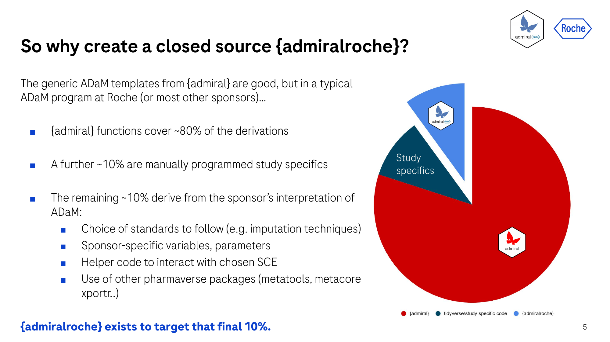
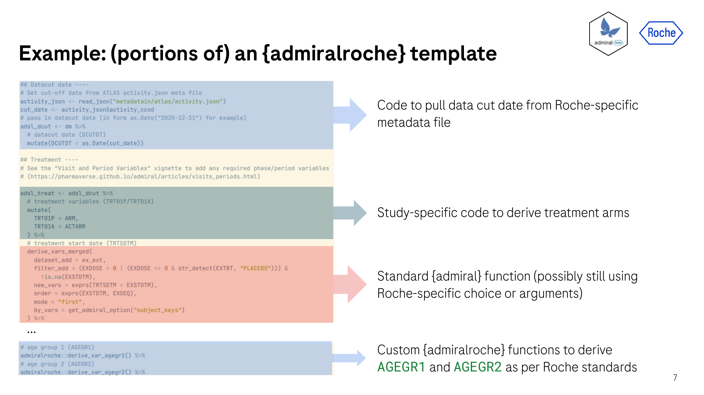
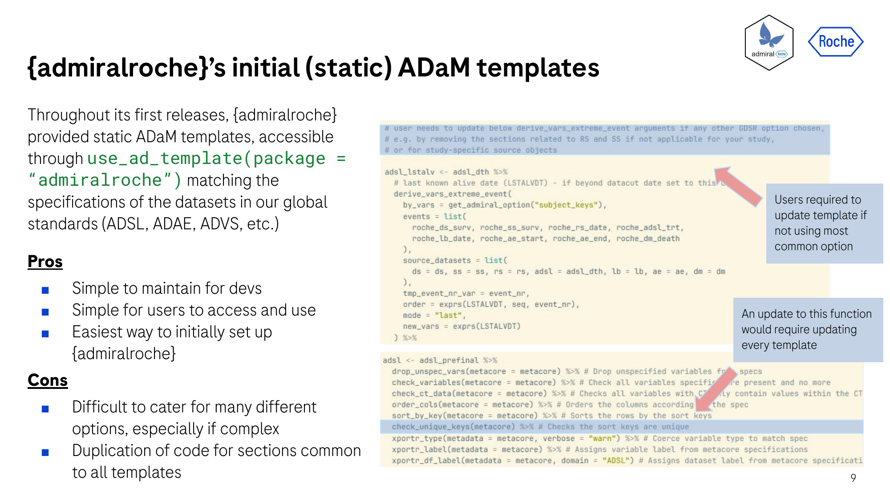
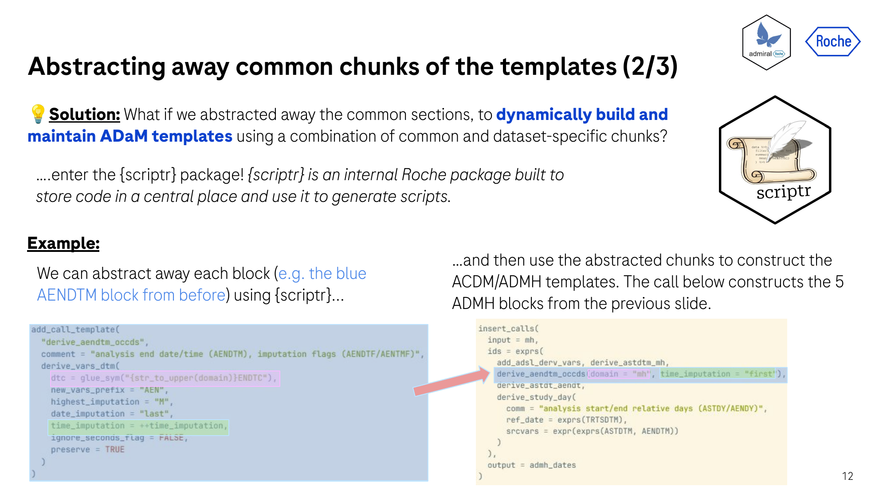
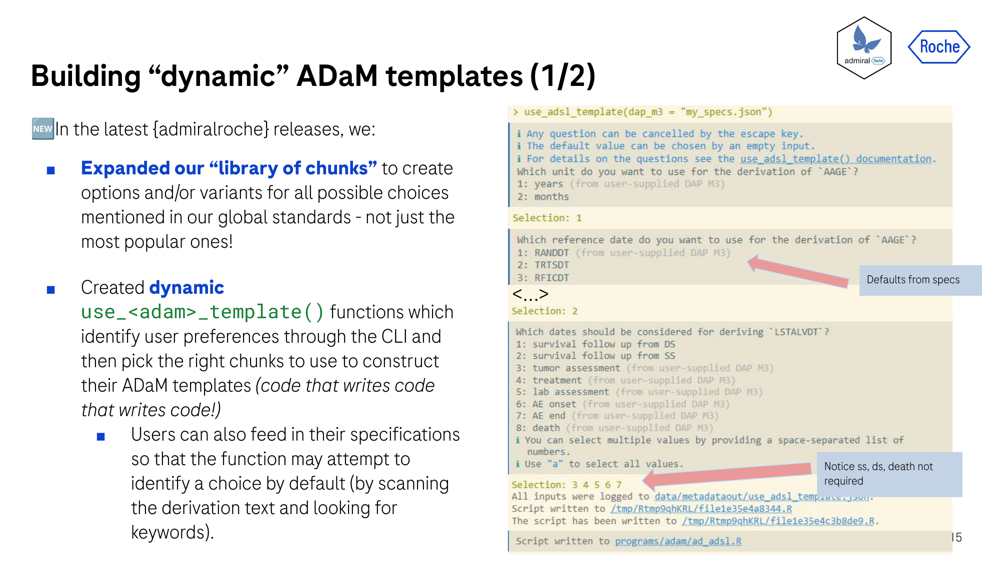
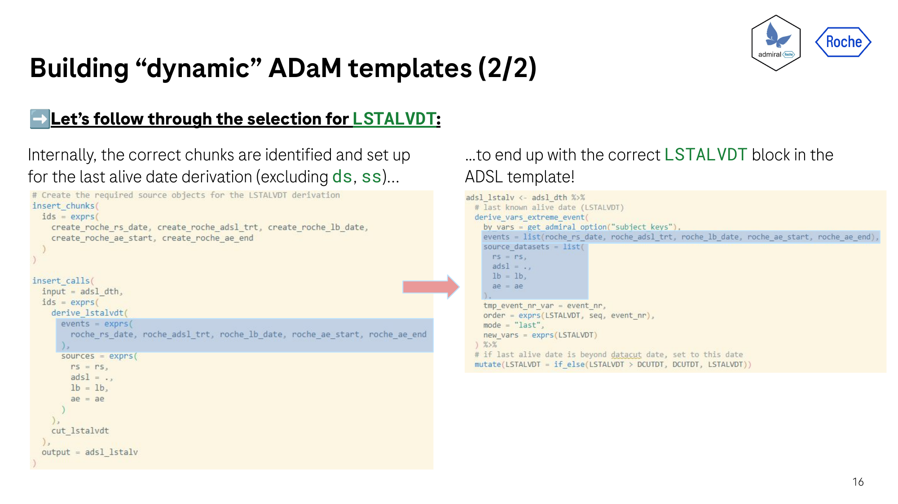

```{r setup, include=FALSE}
knitr::opts_chunk$set(echo = FALSE, warning = FALSE, message = FALSE)
```


# ABSTRACT

Writing template code is just as much an art as it is a skill, requiring balancing solid starting points with flexibility for custom adaptations. For developers, maintaining templates while ensuring consistency and eliminating repetitive tasks is a constant struggle.

Over the past years, Roche's fast transition to R for ADaM programming challenged the `{admiralroche}` team to rethink our process, requiring constant evolution to provide fit for purpose templates. In this paper, we walk readers through our journey of levelling up our templates, starting by exploring how and why we initially set up the `{admiralroche}` package extension and why we then centralised template maintenance by deconstructing templates into modular blocks (code that writes code). Finally, we unveil our latest frontier: dynamic ADaM template generation. By passing ADaM specifications to our package, we automatically create and assemble the right blocks into a customized template script (code that writes code that writes code!).
We will discuss our challenges and learnings, sharing metrics on reduced maintenance and time saved. Join us to see why, in the quest for the ultimate ADaM template, deterministic automation trumps probabilistic AI.


# INTRODUCTION

The `{admiral}` package and its wider "pharmaverse" ecosystem [pharmaverse.org] are the **de facto** standard tools to create Analysis Data Model (ADaM) datasets in R. `{admiral}` deliberately does not attempt to be a complete, drop-in solution; rather, it provides composable, reusable derivation functions and leaves the programmer to decide *which* functions to use, *how* to use them, *in what order* to do so, and most importantly, *where* to intersperse sponsor/study-specific code. This is by design, since the fine details of how any given company or study implements the ADaM standards inevitably vary.

This paradigm has led some sponsors to build company-specific extensions on top of `{admiral}`, which can both:
* Provide custom functions to implement company-specific derivation choices;
* Make available a library of ADaM template scripts that implement those choices in a consistent, repeatable way.

For a presentation and paper discussing Roche's own journey setting up `{admiralroche}`, the interested reader can consult Ross Farrugia's **"OS05: {admiral} – From Open Source Through to Company Implementation"** [presentation](https://phuse.s3.eu-central-1.amazonaws.com/Archive/2024/Connect/US/Bethesda/PRE_OS05.pdf) and [paper](https://phuse.s3.eu-central-1.amazonaws.com/Archive/2024/Connect/US/Bethesda/PAP_OS05.pdf) from the PHUSE US Connect 2024 conference. Building on this material, this paper and the talk it accompanies tell the story of how the way we provide ADaM template scripts through `{admiralroche}` has evolved over time, moving through three distinct stages that give the talk its title:

1. **Code.** A library of static, human-written ADaM template scripts, one per domain, distributed inside `{admiralroche}` itself.
2. **Code that writes code.** An internal R package, `{scriptr}`, that abstracts the common building blocks shared across those templates into reusable, parameterised "chunks" which are then assembled programmatically rather than copy-pasted.
3. **Code that writes code that writes code.** A companion package, `{admiralrochetools}`, that combines `{scriptr}`'s assembly engine with a short interactive questionnaire and a study's own specification, so that running a single function produces a template already tailored to that study's derivation choices, with no manual search-and-replace required.

# BACKGROUND: {admiral}, COMPANY EXTENSIONS, AND THE 80/10/10 RULE

The pharmaverse family of packages exists because CDISC's ADaM Implementation Guide specifies *what* an analysis dataset must contain, but not the exact R code that produces it. {admiral} fills that gap with a toolbox of standard, reusable derivation functions — `derive_vars_dt()`, `derive_vars_merged()`, `derive_param_exist_flag()`, and so on — that can be composed, in any order, into a full ADaM programming pipeline. As Farrugia describes it, once {admiral} reached its 1.0.0 milestone at the end of 2023, sponsor companies needed a place to put the code that {admiral} intentionally does not provide: "we kept in mind the 80/20 rule... in our case at Roche this was creating the closed source `{admiralroche}` package" [OS05]. The same logic produced therapeutic-area extensions such as {admiralonco}, {admiralophtha} and {admiralvaccine} for cross-company standard practices in specific indications, and company extensions such as {admiralroche} for Roche-specific interpretation choices.

In the talk, we refine that 80/20 split into an 80/10/10 split, illustrated in Figure 1. The bulk of any ADaM pipeline (roughly 80%) is genuinely standard {admiral} code that every sponsor can share as-is. A further 10% is Roche-specific but genuinely reusable across studies — sponsor variable and parameter conventions, house imputation rules, integration glue for other pharmaverse packages — and this is exactly what {admiralroche} exists to hold. The final 10% is specific to an individual study or molecule and is not, and should not be, standardised into any shared package at all.

```{r fig1, fig.cap="The 80/10/10 split between shared {admiral} code, reusable Roche-specific code held in {admiralroche}, and genuinely study-specific code.", out.width="42%", fig.align="center"}

```

This framing matters for everything that follows, because both {scriptr} and {admiralrochetools} exist purely to make that middle 10% — the {admiralroche} slice — easier to maintain and easier to apply consistently. Neither tool touches the top slice ({admiral} itself) or the bottom slice (bespoke study code); they are entirely about how efficiently Roche can produce and keep in sync the company-specific layer in between.

It is also worth noting, since it does not appear elsewhere in the talk, that {admiralroche}'s implementation choices are not arbitrary: each {admiralroche} release states in its `NEWS.md` file which version of Roche's internal GDSR Clinical Data Standards specification it implements, identified by a quarterly release codename (recent examples include "Janus," "Savannah," "Ash" and "Bamboo"). This gives {admiralroche} a direct, versioned traceability link back to the standards documents that govern Roche's ADaM conventions — a detail that matters a great deal when a reviewer, auditor, or new team member asks "why does {admiralroche} do it this way?"

# CHAPTER 1: CODE — STATIC ADaM TEMPLATES

The starting point for any {admiral}-based pipeline, at Roche or anywhere else, is a template: a plain R script that chains together the {admiral} derivation functions needed to build one ADaM dataset, in the right order, with the right variables. {admiral} itself ships generic templates via `admiral::use_ad_template()`, and {admiralroche} historically extended this pattern with its own, Roche-flavoured static templates — one script per domain (ADSL, ADAE, ADLB, and so on), each hard-coding Roche's standard interpretation of that domain's derivations. A programmer starting a new study would call the appropriate `use_*_template()` function, receive a copy of the relevant script in their project, and edit it by hand to fit the study at hand. Figure 2 shows a representative excerpt of one such template, annotated to show how {admiral} derivation calls, Roche-specific helper logic, and ordinary R plumbing sit side by side in the same script.

```{r fig2, fig.cap="An excerpt of a static ADaM template, mixing {admiral} derivation calls with Roche-specific logic.", out.width="45%", fig.align="center"}

```

This approach is the simplest possible way to package company-specific ADaM logic, and for a small template library it works well. Figure 3 summarises its strengths and weaknesses as we experienced them in practice.

```{r fig3, fig.cap="Pros and cons of the static template approach.", out.width="45%", fig.align="center"}

```

On the plus side, static templates are the easiest thing to build, the easiest thing to explain to a new team member, and the easiest thing to browse when you just want to see what a "normal" ADSL derivation looks like at Roche. There is no indirection: what you read in the template file is exactly the code that will run.

The cost of that simplicity, however, grows with the size of the template library. By the time {admiralroche} had accumulated more than twenty domain templates, several recurring patterns — for example, the logic for deriving `AENDTM`/`AENDT` consistently across the ADCM and ADMH templates, or standard subject-level flag derivations repeated across nearly every template — existed as near-identical, hand-copied blocks of code in many files at once. Any refactor, bug fix, or change in a Roche standard had to be propagated by hand into every template that contained the affected block, and it was entirely possible for a fix to land in some templates but be missed in others. This is not a hypothetical concern: as one of us described in an earlier PHUSE paper about maintaining {admiral} itself, a single upstream change — the deprecation of `dplyr::vars()` in favour of `rlang::exprs()` — "necessitated updates to 215 {admiral} files, including templates, unit tests and documentation" [OS07]. That was a change to the core package, made once by its maintainers; a change to a Roche-specific pattern duplicated across twenty company templates has no equivalent single point of control, and it was exactly this asymmetry that motivated the next stage of the story.

# CHAPTER 2: CODE THAT WRITES CODE — ABSTRACTING TEMPLATES WITH {scriptr}

## The problem: duplication without a shared abstraction

The static-template approach has no mechanism for saying "this block of code is used, with minor variations, in these six templates — treat it as one thing." Every template is an independent, flat R script, so the *only* way to reuse logic across templates is to copy it. {scriptr} is Roche's internal answer to this problem: an R package that introduces a proper abstraction layer between "a reusable unit of ADaM logic" and "a finished script," so that a change to the underlying logic only ever needs to be made in one place.

## Core data model: chunks and calls

{scriptr} organises code around two first-class objects, referred to internally as **chunks** and **calls**. A chunk is a general-purpose, reusable block of R code — anything from a single derivation call to a short multi-line sequence — registered once via `add_chunk()` and retrieved later via `get_chunk()`. A call is the more specialised case of a chunk that wraps exactly one function invocation (typically an {admiral} derivation function), registered via `add_call()` and retrieved via `get_call()`. Both chunks and calls can also be registered as *templates* — via `add_chunk_template()` and `add_call_template()` respectively — meaning they contain placeholders to be filled in at assembly time rather than fixed, literal code.

Registered chunks and calls live in an in-memory store attached to the current R session, and {scriptr} provides `get_reactable()` to browse the full contents of that store interactively (rendered as a searchable table), which is invaluable when a developer is trying to find out whether a chunk implementing a given piece of logic already exists before writing a new one. Because different packages may want to maintain their own independent chunk libraries, {scriptr} supports a **federated store** pattern: `set_scriptr_sources()` lets a downstream package (such as {admiralrochetools}, discussed in Section 6) register its own chunk source alongside or instead of the default one, and `get_source_env()` resolves which environment a given lookup should use. `clear_scriptr_store()` resets a store, which is mainly useful in package tests and examples. This federation is precisely what allows {admiralrochetools} to define its own, larger chunk library (covering many more parameterisation options than {admiralroche}'s original static templates) without needing to fork or duplicate {scriptr} itself.

## Templating syntax

The templating mechanism is deliberately built on vocabulary borrowed from {rlang}'s quasiquotation, since many R developers already have some intuition for it. A chunk or call template can mark a placeholder for single-value substitution with a `++` sigil (mirroring `!!`), and a placeholder for multi-value, "splice in a list" substitution with `+++` (mirroring `!!!`). When a template is instantiated, values are supplied for these placeholders — a single call for a single study parameterisation, or a whole tibble of parameter combinations for row-wise instantiation, which lets a developer generate an entire family of near-identical derivations (for example, one flag derivation per row of a specification table) from a single template definition in a single call.

Two helper functions cover the common cases of building up dynamic text inside a template: `glue_sym()` constructs a syntactically valid R symbol from string fragments (for example, gluing a variable stem and a suffix into a single identifier), while `glue_char()` builds a dynamic character string, and can lean on `{cli}`'s pluralisation helpers so that, for example, a comment can correctly say "the following variable" versus "the following variables" depending on how many were substituted. Where a literal value needs to be inserted as an R string constant or a vector of string constants rather than interpreted, `quote()` and `quotes()` provide convenience wrappers.

## Assembly: from chunks to a finished script

Registering chunks and calls is only half of {scriptr}; the other half is turning a selection of them into an actual, well-formatted R script. `insert_chunks()` takes a list of chunk identifiers (conventionally captured as unevaluated expressions via `exprs()`, so that argument names can double as chunk identifiers) and inlines them, in the order given, into the developing script. `insert_calls()` does the equivalent job for calls, and additionally understands the notion of an "input" and an "output" — letting a developer specify, for instance, that a chain of calls should thread the same dataset through each derivation step in turn, producing a pipe-style sequence rather than a flat list of independent statements. In both cases, ordering is exactly the order supplied by the caller; {scriptr} does not attempt to infer dependencies between chunks automatically, which keeps its behaviour predictable and easy to reason about, at the cost of putting the responsibility for correct ordering on whoever is calling it (in practice, either a human developer or, in {admiralrochetools}'s case, a purpose-built template generator that already knows the correct domain-specific order).

The top-level entry point that ties this together is `execute()`, which takes an accumulated set of chunk/call insertions together with a target filename and produces a finished `.R` file. Before writing that file, {scriptr} passes the assembled code through {styler}'s `style_code()`, using a house style configuration, so that the generated script is indistinguishable in formatting from one a Roche programmer would have written by hand — consistent indentation, consistent pipe placement, and no tell-tale artefacts of programmatic generation. Figure 4 shows a worked example from the talk of a chunk-based template definition alongside the finished, assembled script it produces.

```{r fig4, fig.cap="A {scriptr}-based template definition (left) and the finished, formatted ADaM script it assembles (right).", out.width="46%", fig.align="center"}

```

## Preserving comments and documentation

A subtlety that any tool assembling code from fragments has to solve is what happens to comments. Naively concatenating expression objects in R silently drops comments, because R's parser does not retain them as part of the abstract syntax tree by default. {scriptr} works around this using R's `getParseData()`, which — when a chunk of source is parsed with `keep.source = TRUE` — exposes the full parse tree including comment tokens and their exact source positions. Internally, {scriptr} defines an S3 class (a `pd_tree_node`-style representation) that wraps this parse data so that inline comments attached to a chunk's *own* source code survive being carried through into the assembled output, provided the original chunk was written inside an explicit `{ }` block (comments outside such a block are not source-tracked in the same way and are not preserved).

Separately, {scriptr} supports two distinct ways of attaching human-readable text to a chunk or call: a `description`, which is pure metadata used for searching and browsing the store (via `get_reactable()`) and never appears in the generated script at all, and a `comment` argument, which *is* literally emitted as a `#`-prefixed comment line directly above the generated code. The `comment` argument can reuse the chunk's `description` by default, can be a vector (producing a multi-line comment block), and can itself use `glue_char()` to build dynamic, pluralisation-aware text — for example, automatically writing "Derive the following variable:" or "Derive the following variables:" depending on how many placeholders were substituted into that particular instantiation. This distinction between silent metadata and code-visible commentary is a small design choice, but it is one we think is worth calling out explicitly for anyone building a similar tool: it lets a chunk library be richly documented for the people maintaining it, without cluttering every generated script with information only relevant to that maintenance activity.

## Lessons for building a similar tool

We do not think {scriptr}'s specific implementation choices are the only correct way to build a "code that writes code" layer, but the overall shape — (1) a typed store of reusable, named units of code; (2) a small, borrowed-vocabulary templating syntax for parameterising them; (3) an assembly engine that threads them together in caller-specified order; and (4) a final auto-formatting pass so the output is indistinguishable from hand-written code — is, in our experience, close to the minimum viable feature set for this kind of tool to be trusted by the programmers who will use its output. Two things we would flag as worth deciding early if a reader is planning something similar: whether comments and documentation are first-class (as they are in {scriptr}, via the `description`/`comment` split), since generated code that a reviewer cannot understand at a glance will not be trusted regardless of how correct it is; and whether ordering is inferred or caller-specified, since {scriptr}'s choice to keep ordering fully explicit trades a small amount of convenience for a large amount of predictability.

# WHY TWO PACKAGES? THE {admiralroche}/{admiralrochetools} SPLIT

The talk, for the sake of a clean narrative, presents {admiralroche} as the single home for everything Roche-specific. In reality, as {scriptr}-based template assembly matured into the fully dynamic, DAP-driven template generation described in Section 6, the template-generation machinery itself was deliberately moved out of {admiralroche} and into a new, separate package: {admiralrochetools}. This section explains why, since the CLAUDE.md brief for this paper specifically asked us to surface this reasoning, and we think it is a useful data point for other sponsor companies weighing the same decision.

## What the version history says

{admiralroche}'s own `NEWS.md` documents the split explicitly across two releases. Version 1.6.0 records the initial separation:

> "The `{admiralroche}` package was split into two packages: `{admiralroche}` and `{admiralrochetools}`... `{admiralroche}` should be included in submission while there is no need to include `{admiralrochetools}`"

and by version 1.7.0 the migration was completed:

> "ADaM templates are no longer provided through `{admiralroche}`. Instead, static and dynamic ADaM templates are now available through the `{admiralrochetools}` package"

Along the way, the `use_bds_template()` and `use_occds_template()` generic template functions, and the "Explore ADaM Templates" vignette, all moved from {admiralroche} into {admiralrochetools}. The one sentence in the 1.6.0 note — *"there is no need to include `{admiralrochetools}`"* in a submission — is, in our view, the single most important line in the whole history, and it is worth unpacking why.

## Reason 1: submission scope

Every R package used to produce a dataset that is part of a regulatory submission package typically needs to be documented, version-pinned, and in some cases justified to a health authority reviewer as part of that submission's software environment. {admiralroche} contains the actual derivation logic — the {admiral}-based Roche-specific functions that are *executed* when an ADaM dataset is produced — and so, like {admiral} itself, it legitimately belongs in that documented environment. {admiralrochetools}, by contrast, contains only the machinery used to *generate the starting-point template script* for a study, before a programmer has even begun deriving anything. Once a template has been generated, the resulting `.R` script depends only on {admiral} and {admiralroche} to run; {admiralrochetools} plays no further role and need not be installed, let alone documented, in the environment that actually produces submission datasets. Separating the two packages makes this distinction structural rather than a matter of convention that could be forgotten or misapplied on any individual study.

## Reason 2: package size and dependency footprint

The two packages also differ substantially in size and in what they depend on, which is itself a consequence of the different jobs they do. On disk, in our current installed library, {admiralroche} occupies roughly 2.4 MB while {admiralrochetools} occupies roughly 5.2 MB — more than double, despite {admiralrochetools} containing no ADaM derivation logic of its own. That extra weight comes from what dynamic template generation actually requires: {admiralrochetools} needs to depend on {scriptr} for assembly, on YAML- and JSON-handling packages to read question definitions and DAP specifications, and on packages that support building and running an interactive command-line dialogue — none of which {admiralroche} has any reason to depend on, since its job is simply to provide derivation functions that a study's own (already generated) template calls at execution time. Table 1 summarises the practical contrast between the two packages as we currently maintain them.

| | {admiralroche} | {admiralrochetools} |
|---|---|---|
| **Purpose** | Roche-specific ADaM derivation functions | Interactive/dynamic ADaM template generation |
| **License** | Roche internal use only | Apache License (>= 2) |
| **Installed size** | ~2.4 MB | ~5.2 MB |
| **Depends on `{scriptr}`?** | No | Yes |
| **Include in a regulatory submission?** | Yes | No |
| **Used when?** | Every time an ADaM dataset is programmed | Once, at the start of a study, to generate the template |

: Table 1. A practical contrast between {admiralroche} and {admiralrochetools}.

Interestingly, the two packages' license fields also diverge in a way that mirrors this reasoning: {admiralroche}'s `LICENSE` file states simply "For Roche internal use only," reflecting that its derivation logic encodes Roche-specific, potentially business-sensitive interpretation choices, whereas {admiralrochetools} is licensed under the Apache License (>= 2), leaving the door open to sharing the *general-purpose* pattern of DAP-driven interactive template generation more broadly — while its actual chunk library, of course, still lives behind Roche's internal chunk-store configuration.

## Reason 3: separation of concerns for maintenance

A more mundane but no less real motivation is ordinary software engineering hygiene. {admiralroche}'s test suite is concerned with whether a given derivation function produces the correct ADaM values for known inputs — a well-defined, largely deterministic testing problem well served by the same `{admiral}`-style unit-testing conventions the rest of the pharmaverse uses. {admiralrochetools}'s test suite is concerned with a different, messier problem: whether a CLI dialogue asks the right question given a particular DAP specification, whether a malformed or ambiguous specification is handled gracefully, and whether the assembled output is syntactically and semantically correct R. Keeping these two very different testing surfaces in two separate packages, each releasing on its own cadence, has made both easier to maintain than a single combined package would have been — a smaller, more focused package is a smaller, more focused thing to reason about, review, and release.

# CHAPTER 3: CODE THAT WRITES CODE THAT WRITES CODE — DYNAMIC TEMPLATE GENERATION

## From "assemble what a developer selects" to "ask the study what it needs"

{scriptr} solves the maintenance problem of Chapter 2: a change to shared logic now needs to be made in exactly one chunk, not in twenty templates. But a developer using {scriptr} directly still has to know, for every derivation with more than one valid implementation, which variant this particular study needs, and manually select the right chunks and the right template parameters. {admiralrochetools} closes this final gap by asking the study itself. Every Roche study already has a machine-readable **Data Analysis Plan (DAP) M3 specification** — a structured document (in our case represented as JSON) that records, dataset by dataset and variable by variable, exactly how each ADaM variable should be derived for that study, including the specific sponsor choices (which reference date to use for age, which population definition to use for the intent-to-treat flag, and so on) that Section 3 of this paper described as the genuinely reusable-but-variable middle 10%. {admiralrochetools} reads that specification directly and, wherever it can extract an unambiguous answer from it, uses it; wherever the specification is silent or ambiguous, it asks the programmer a short, targeted question instead.

## Question definitions

Each ADaM domain admiralrochetools supports (at the time of writing: ADSL, ADAE, ADEG, ADEX, ADHY, ADLB, ADRS, ADTTE and ADVS) has an accompanying YAML file of question definitions, one entry per decision point the template generator needs resolved. Each entry specifies the question text to show the programmer, the valid answer options, a rule for deriving a *default* answer directly from the DAP M3 specification text (so that, whenever possible, the programmer is never asked something the specification already answers), and free-text notes. A representative excerpt from the ADSL question file illustrates the pattern:

```yaml
- Question: Which subjects do you want to consider for the derivation of `ITTFL`?
  Options: '`"randomized"`, `"enrolled"`'
  Default_from_DAP_M3: >
    `"randomized"` if the `ITTFL` derivation contains the text
    `"[DS.DSDECOD] = 'RANDOMIZED'"`, `"enrolled"` otherwise
  Notes: ""
```

Resolving that default requires matching against the free-text derivation description in the DAP specification, which {admiralrochetools} does with a small family of specification-parsing helpers: `reduce_json()` narrows the full study specification down to the section relevant to the dataset currently being generated, `extract_value_from_specs()` and `extract_multi_match_from_specs()` pattern-match specific keywords or phrases within a variable's derivation text to resolve a default answer (as in the `ITTFL` example above), and `get_var_specs()`/`get_required_vars()` pull out a variable's full metadata and requiredness flags respectively. Where the specification does not resolve a question, the programmer is prompted interactively; `get_input_info()` orchestrates this end-to-end, falling back to simple `read_user_input()`/`read_user_choice()` prompts validated by small acceptor functions such as `accept_integer()` or `accept_integer_list()`, so that, for example, a question expecting a positive integer cannot be answered with free text. Figure 5 shows this dialogue from the talk's worked LSTALVDT example.

```{r fig5, fig.cap="The interactive question-and-answer dialogue for a dynamically generated template, with defaults resolved from the study's DAP M3 specification where possible.", out.width="46%", fig.align="center"}

```

## From answers to an assembled template

Once every question for a domain has been resolved — whether from the specification directly or from the programmer's answers — {admiralrochetools} calls into its own {scriptr}-based chunk library (registered as a federated {scriptr} source specific to this package, as described in Section 4) to assemble the finished template, using top-level entry points such as `create_adam()` and `add_subject_keys()` as the backbone that each domain-specific `use_*_template()` function builds on. Because the chunk library was designed from the outset to cover every option the question files can produce an answer for, the resulting script is not a generic skeleton requiring manual completion, but a fully worked, study-specific template — indistinguishable, in the finished code, from what a Roche programmer would have written by hand for that exact set of derivation choices. Figure 6 shows the complete worked example from the talk: the LSTALVDT (last known alive date) derivation, assembled automatically from the programmer's answers to a handful of short questions.

```{r fig6, fig.cap="The assembled LSTALVDT derivation, generated automatically from the answers gathered in Figure 5.", out.width="46%", fig.align="center"}

```

## An audit trail for free

A detail not shown on the slides but worth recording here: every dynamic template-generation session writes an "info file" recording exactly which questions were asked, what the programmer (or the DAP specification) answered, and which package versions produced the result, via `start_input_tracking()`/`stop_input_tracking()`. This was not a strict requirement when the feature was built, but it has turned out to be a genuinely useful side effect: it gives programmers, reviewers and QC staff downstream a durable record of *why* a generated template looks the way it does, months after the fact, without anyone having had to remember to write that justification down by hand.

## A living tool: version history

{admiralrochetools} has itself evolved quickly since its first release. Version 0.1.0 ("Savannah") launched with dynamic generation support for five domains — ADSL, ADAE, ADLB, ADRS and ADTTE. Version 0.1.1 ("Ash") added ADVS support and switched the source of a study's data-cut date configuration to a newer internal activity-tracking format. Version 0.2.0 ("Bamboo"), the version installed at the time of writing, added ADEX, ADHY and ADEG, bringing the total to eight domain-specific generators, alongside the more general `use_bds_template()` and `use_occds_template()` functions inherited from {admiralroche} in the 1.6.0 split described in Section 5. This cadence — a new domain or two roughly every quarter, tracking the same GDSR release-train codenames used by {admiralroche} itself — gives us reasonable confidence that dynamic generation will, in time, cover the full set of ADaM domains Roche studies routinely need.

# REFLECTIONS AND FURTHER WORK

Looking back, we do not think we could have jumped straight from static templates (Chapter 1) to fully dynamic, DAP-driven generation (Chapter 3) even if we had known from the outset that this was where we would end up. {scriptr}'s chunk/call abstraction had to exist, be trusted by developers, and prove itself on hand-selected templates first, before it was a credible foundation for a tool that selects and assembles chunks *automatically* on a programmer's behalf. Each stage of this journey was also, deliberately, a fully **deterministic** piece of automation: a given DAP specification and a given set of question answers will always produce the same generated script, byte for byte. We think this was the right choice for this problem, precisely because ADaM programming sits inside a heavily regulated, audit-sensitive process where reproducibility and explainability of the generated artefact matter as much as the artefact's correctness. That said, we have not yet rigorously quantified the maintenance-time or error-rate savings this evolution has produced; doing so properly — for example, by comparing defect rates or review turnaround time on studies built from dynamically generated templates against a matched set built from static ones — remains an open piece of further work, and one we would encourage other companies pursuing a similar path to plan for from the start, rather than treating it as an afterthought as we did.

Looking forward, we see two natural next steps. The first is incremental: extending {admiralrochetools}'s domain coverage and question sophistication, and continuing to fold learnings from real studies back into the chunk library and question definitions as edge cases surface. The second is more speculative, and is where large language models plausibly enter this pipeline for the first time: today, the DAP-specification-parsing helpers described in Section 6 rely on pattern-matching known phrases in free-text derivation descriptions, which is robust but brittle to phrasing the pattern-matcher was not written to expect. An LLM-based reader of the same free-text specification could plausibly resolve a wider range of phrasing with less maintenance of hand-written patterns, while still leaving the final, deterministic assembly step — the part that actually needs to be reproducible and auditable — entirely in {scriptr}'s hands. We would treat this as an enhancement to the specification-reading step only, not a replacement for the deterministic generation engine underneath it.

# RECOMMENDATIONS

For any organisation considering a similar journey, our main recommendations, in order of how early we think they matter, are:

1. **Do not skip straight to dynamic generation.** Build the reusable-chunk abstraction ({scriptr}'s role in our story) first, on a codebase your developers already trust, before trying to automate the selection of chunks. Trust in the underlying building blocks is what makes the final, more automated layer credible.
2. **Decide submission scope early, and let it drive package boundaries.** Our {admiralroche}/{admiralrochetools} split (Section 5) happened somewhat after the fact; had we designed for the "does this need to be in a submission's software environment?" question from the start, we could have made that split earlier and more cleanly.
3. **Make comments and documentation first-class in your assembly engine**, not an afterthought bolted on later. Generated code that a human reviewer cannot understand at a glance will not be trusted, no matter how correct it is.
4. **Keep the generation step deterministic**, and keep an audit trail of what was asked and answered. Both properties cost little to build in from the start and are expensive to retrofit later, and both matter a great deal in a regulated environment.
5. **Read your own specifications before asking your programmers anything.** The single biggest reduction in manual effort in our pipeline did not come from generating code faster — it came from not asking a question the DAP specification had already answered.

# CONCLUSION

The journey from static ADaM templates, through {scriptr}'s reusable chunk abstraction, to {admiralrochetools}'s fully dynamic, specification-driven template generation reflects a fairly ordinary software engineering instinct — notice duplication, abstract it, then automate the selection of the abstraction — applied to a domain, regulated clinical trial programming, where that instinct is not always the first one people reach for. We hope that by setting out both the narrative (in the accompanying talk) and the internal mechanics (in this paper) we have given other sponsor companies a genuine starting point for making the same journey, whether or not they choose the same tools to make it.

# ACKNOWLEDGEMENTS

We are especially grateful to Stefan Bundfuss, the lead developer of both {admiralroche} and {scriptr}, whose design work is the foundation this entire talk and paper describe. We also thank our wider Roche statistical programming community for continuing to build, test and refine the templates and chunk libraries described here.

# RECOMMENDED READING

- Farrugia, R. (2024). *{admiral} - from open source through to company implementation*. PHUSE EU Connect 2024, Paper OS05.
- Mancini, E. (2024). *Two hats, one noggin: Working as a developer and as a user of the {admiral} R package for creating ADaMs*. PHUSE EU Connect 2024, Paper OS07.
- The pharmaverse family of R packages: <https://pharmaverse.org>
- {admiral} package documentation and Programming Strategy vignette: <https://pharmaverse.github.io/admiral/>

# CONTACT INFORMATION

Your comments and questions are valued and encouraged. Contact the authors at:

Gordon Miller
Roche Products Ltd
Welwyn Garden City, UK
Email: gordon.miller@roche.com

Edoardo Mancini
Roche Products Ltd
Welwyn Garden City, UK
Email: edoardo.mancini@roche.com

Any trademarks mentioned in this paper are the property of their respective owners.
